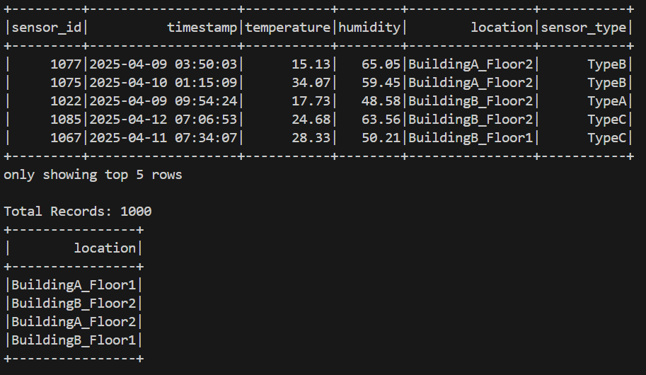
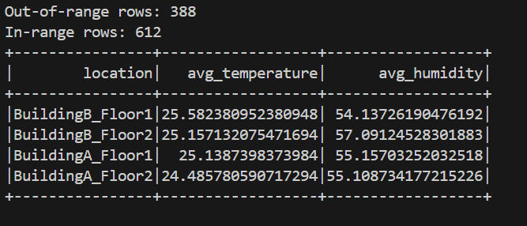
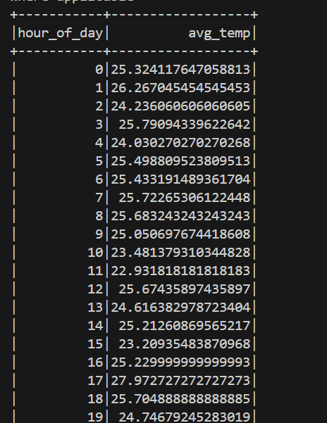
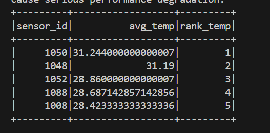

# iot-sensor-data-spark-sql# IoT Sensor Data with Spark SQL

This assignment demonstrates how to analyze IoT sensor data using Apache Spark SQL. The dataset simulates sensor readings including temperature, humidity, location, and type, collected over time. We will:

- Load and explore structured sensor data
- Perform filtering and aggregation using SQL
- Conduct time-based analysis
- Apply window functions for ranking
- Create pivot tables for multidimensional comparison

Each task produces a final output CSV file stored in the `output/` directory.

## Prerequisites

To run this project locally, we’ll need:

### Tools & Libraries

- Apache Spark 3.x
- Python 3.8+
- `pyspark` (install with `pip install pyspark`)
- `faker` (install with `pip install faker`)

### Data Generation

This project uses a simulated dataset generated by `data_generator.py`. It creates a `sensor_data.csv` file that mimics real-world sensor output.

To generate the dataset:

```bash
python data_generator.py
```

This will save `sensor_data.csv` in your working input directory.

## File Structure

```
iot-sensor-data-spark-sql-Scheruk1701/
├── input/sensor_data.csv              # Simulated sensor readings
├── output/                            # CSV output files from each task
├── src/
│   ├── task1_load_explore.py          # Load and explore data
│   ├── task2_filter_aggregate.py      # SQL filtering and location aggregation
│   ├── task3_time_analysis.py         # Hourly temperature analysis
│   ├── task4_sensor_ranking.py        # Ranking sensors using window functions
│   └── task5_pivot_hour_location.py   # Pivot temperature by hour and location
├── data_generator.py                  # Generates sensor_data.csv
└── README.md                          # Assignment instructions and explanations
```

## Task Breakdown

### Task 1: Load & Basic Exploration

**Goal**: Load the dataset, view structure, and run initial SQL queries.

- Loaded `sensor_data.csv` with schema inference
- Registered as `sensor_readings` temp view
- Executed:
  - `SELECT *` to view top 5 rows
  - Count of all records
  - Distinct locations
- Saved full DataFrame to `output/task1_output`

### Task 2: Filtering & Simple Aggregations

**Goal**: Filter by temperature and analyze averages by location

- SQL filter for in-range (18–30 °C) vs. out-of-range readings
- Grouped by `location` to compute `AVG(temperature)` and `AVG(humidity)`
- Sorted by `avg_temperature`
- Output saved to `output/task2_output`

### Task 3: Time-Based Analysis

**Goal**: Analyze temperature trends across 24 hours

- Converted `timestamp` to `TimestampType`
- Extracted `HOUR(timestamp)` in SQL
- Grouped by hour to compute `AVG(temperature)`
- Saved results to `output/task3_output`

### Task 4: Window Function - Sensor Ranking

**Goal**: Rank sensors by average temperature using SQL window functions

- Grouped by `sensor_id`, calculated average temperature
- Used `DENSE_RANK()` to rank by temperature (DESC)
- Selected top 5 ranked sensors
- Result saved to `output/task4_output`

### Task 5: Pivot & Interpretation

**Goal**: Create a pivot table of avg temperature by hour and location

- Step 1: Used SQL to extract `hour_of_day` and avg temp
- Step 2: Used DataFrame API to pivot with `location` as rows, `hour_of_day` as columns
- Flattened and saved to `output/task5_output`
- Identified the hottest (location, hour) from pivoted data
 ## Task-1 sample output
 
## Task-2 sample output
 
 ## Task-3 sample output
 
 ## Task-4 sample output
 
 ## Task-5 sample output
 

## Common Errors & Solutions

### Error: CSV doesn’t support `update` or `complete` mode

- Fix: Used `foreachBatch()` and wrote output manually batch-by-batch

### Error: Cannot write `window` struct column to CSV

- Fix: Flattened `window.start` and `window.end` into separate columns

### Error: Pivoting not available in Spark SQL

- Fix: Used SQL for aggregation, PySpark DataFrame API for pivoting

## Conclusion

With this assignment we learned how to:

- Load and explore IoT sensor data in Spark
- Apply SQL for filtering, aggregations, and ranking
- Use window and time-based functions
- Create pivot tables for multi-dimensional insight

By combining SQL with PySpark's DataFrame API, we leveraged the strengths of both approaches to complete a realistic, end-to-end data analysis pipeline.